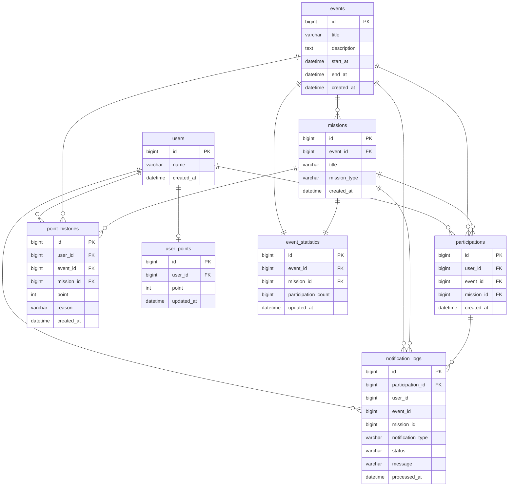

# ERD

## 概要

本システムでは、イベント参加処理のために以下のテーブルを使用します。

```text
users
events
missions
participations
notification_logs
event_statistics
point_histories
user_points
```

中核となるテーブルは `participations` です。

`participations` は、ユーザーがどのイベントのどのミッションに参加したかを保存するテーブルであり、参加状態の最終的な正本として扱います。

また、参加完了後の付随処理として、通知処理履歴、統計集計、ポイント履歴、ユーザー別ポイント残高を管理します。


---

## Mermaid ERD


